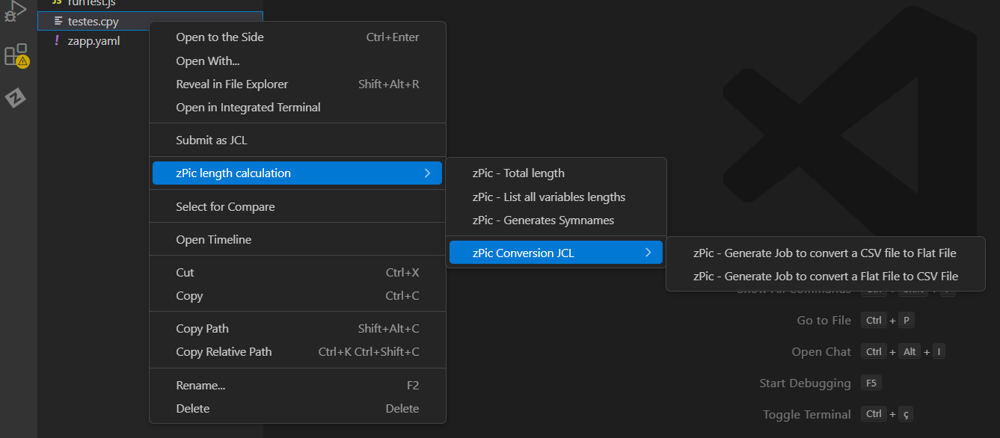
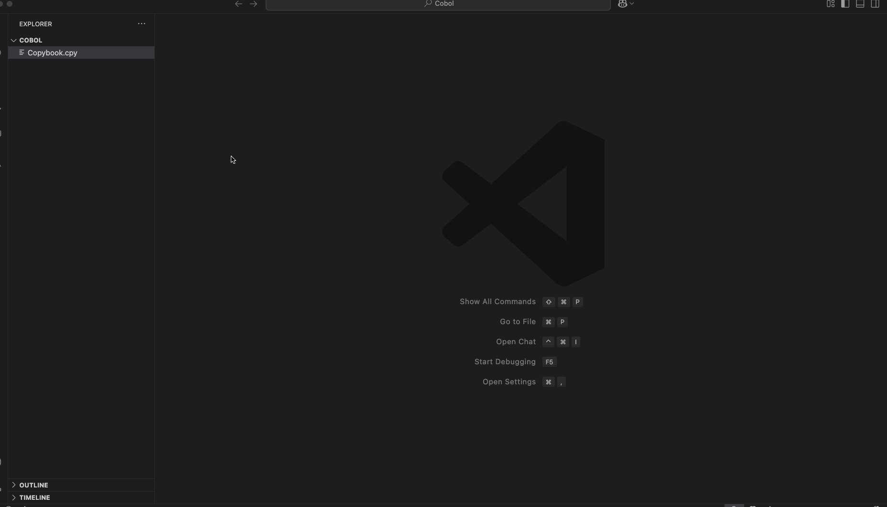
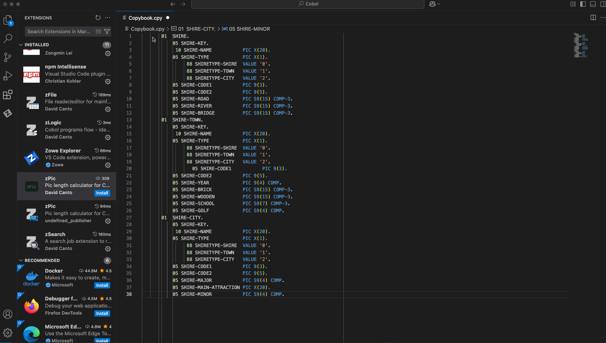
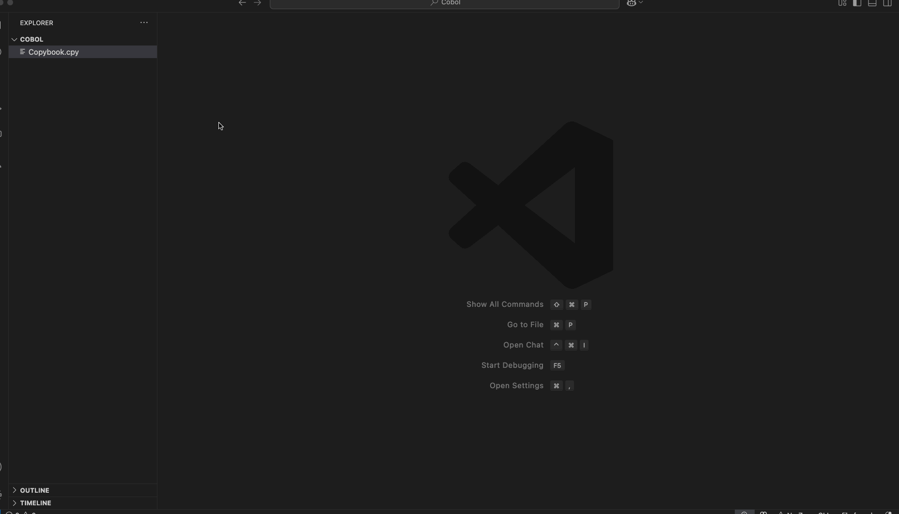

# README

zPic Calculator extension calculates the length of the total sum value from the PIC of all variables selected in the data definition of a Cobol Program or a Copybook. Pic calculates the length for alphanumeric, numeric, computational, binary.

## Features

All features can be accessed by right clicking and accessing the zPic menu options. The menu is available for cobol programs and copybooks on:
- [x] Open documents when language id is *cobol* and list of variables is selected.
- [x] Documents selected on the VS Code Explorer with the extensions .cpy, .copy, .cbl, .cob.
- [x] Documents selected on the Zowe Explorer with the extensions .cpy, .copy, .cbl, .cob.

### Available Features:

1. **zPic Calculator - Total**: Returns the total sum length value of all selected variables.

     > On a open documento the total value is showed just by selecting the variables. On Zowe Explorer and Explorer the functionally is available thru a menu.

1. **zPic - List all variables lengths**: Opens a right panel showing the length, beginning and ending position of every variable in the selection.

2. **zPic - Generates Symnames**: Generates document with the *Symnames* declaration to use in JCL.

     > Symnames - [IBM - Using symbols for fields in DFSORT statements](https://www.ibm.com/docs/en/zos/2.4.0?topic=symbols-using-fields-in-dfsort-statements)

1. **zPic Conversion JCL**: Generates a Job Control Language (jcl) document to convert a csv file from/to flat file.
   1. **zPic - Generate Job to convert a Flat File to CSV File**: A Job Control Language document to convert a Flat File to a CSV file.
   2. **zPic - Generate Job to convert a CSV file to Flat File**: A Job Control Language document to convert a CSV File to a Flat File with the definition of selected fields. The generated JCL is showed in a editor.

## Requirements

1. Required: [Visual Studio Code](https://code.visualstudio.com/) version 1.99.0 or above.
2. Cobol Language suport. **Recommended** [IBM Z Open Editor](https://marketplace.visualstudio.com/items?itemName=IBM.zopeneditor).

> **Recommended**: [Zowe Explorer](https://marketplace.visualstudio.com/items?itemName=Zowe.vscode-extension-for-zowe) (only necessariy for acessing copybook documents on mainframe).

## Extension Settings

This extension contributes the following settings:

* `zPic.Job.Card.JobName`: Name to be used in the definition in the definition of both jcl to convert *csv* files to *flat files*.
  - max length: 8;
* `zPic.Job.Card.Class`: Class to be included in the Job Card.\nExemple: CLASS=X.
  - min length: 1;
  - max length: 1;
* `zPic.Job.Card.MsgClass`: Message Class to be included in the Job Card.\nExemple: MSGCLASS=X.
  - min length: 1;
  - max length: 1;
* `zPic.Job.Files.Input`: Default file name to be used in the job as input file.\nFile names can be defined/changed in editor.
* `zPic.Job.Files.Output`: Default file to be used in the job as output file.\nFile names can be defined/changed in editor.
* `zPic.CSV.Delimiters`:CSV delimiters are characters that separate individual data fields within a row on a CSV file.
  - min length: 1;
  - max length: 1;
  - Possible values:

  | Character | Description |
  | --------- | ----------- |
  | ";"       | Semicolon   |
  | ","       | Coma        |

* `zPic.CSV.DecimalPlaceDelimiters`: File to be used in the job as output file.\nFile names can be defined/changed in editor.

  | Character | Description |
  | --------- | ----------- |
  | ","       | Coma        |
  | "."       | Dot         |

## Known Issues

n/a

## Release Notes

### 2.0.0 - 2025-05-11

- Replaced the menu and message to represent the total sum value of all selected variables. Now the total will be showed near the selected variables without the need to right click menu, just select the variables and the total will be represented.
- A new design for the list of variables.
- fixed some bugs on jcl definition
- Input and output files can now be introduced before the job is generated.
- ***(new)*** Ability to select a copybook from Vscode Exporer and Zowe Explorer

### 0.0.5 - 2023-12-19

-Resolved a erro in calculating formatted fields.

### 0.0.4 - 2023-12-16

-Initial release of zPic Calculator for VS-Code
